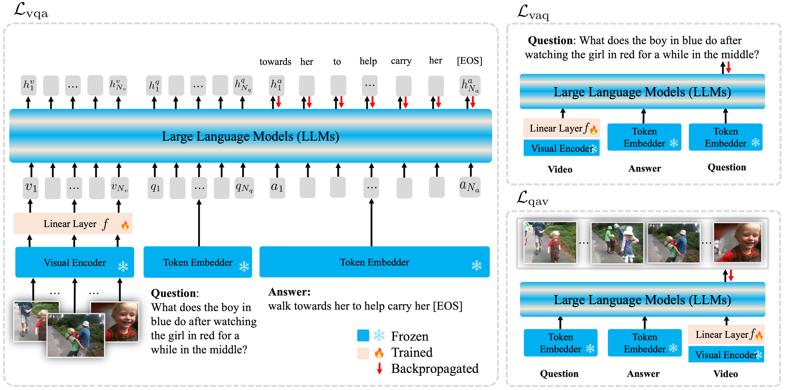

# Large Language Models are Temporal and Causal Reasoners for Video Question Answering 

This is the official implementation of Flipped-VQA (EMNLP 2023).

> Dohwan Ko1*, Ji Soo Lee1*, Wooyoung Kang2, Byungseok Roh2, Hyunwoo J. Kim1.
>
>
> 1Department of Computer Science and Engineering, Korea University   2Kakao Brain

  

Code will be available in a few days!